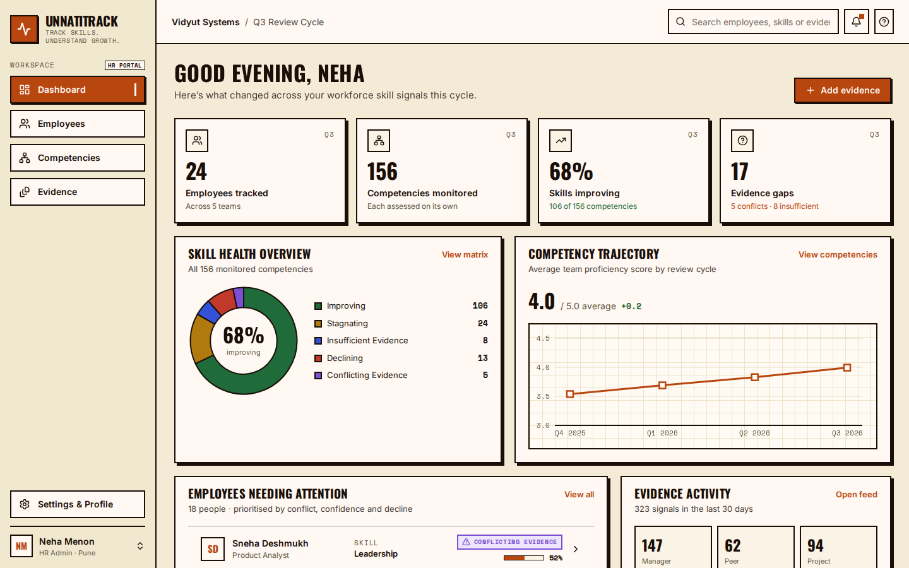
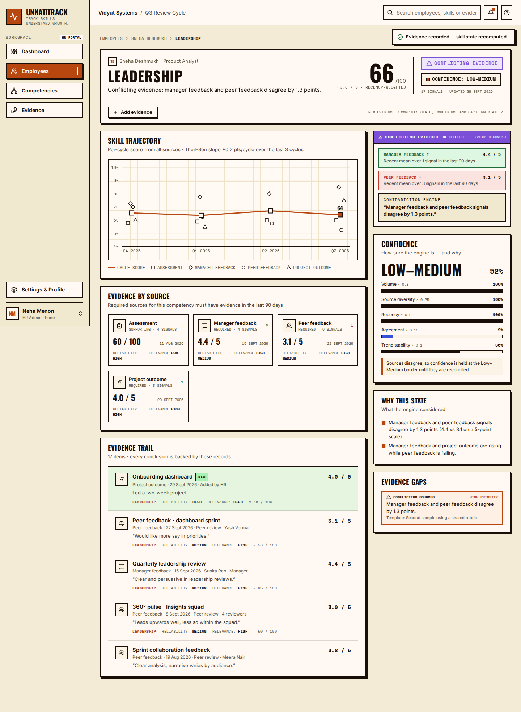
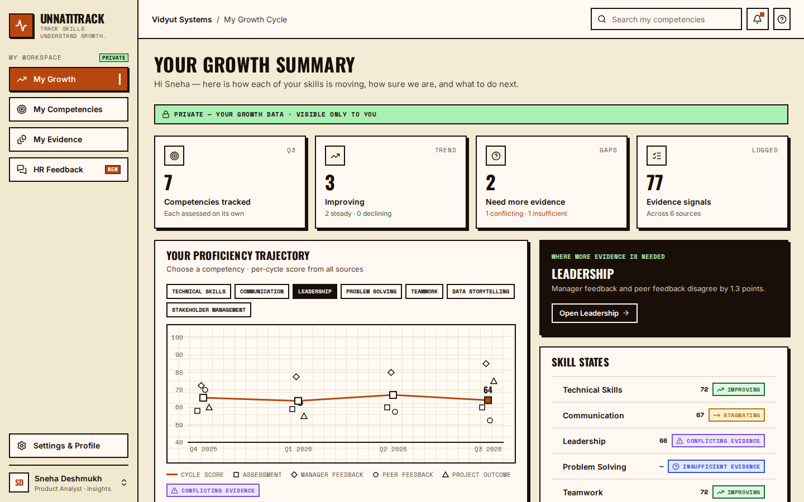

# UNNATITRACK

**Track Skills. Understand Growth.** — Continuous Talent Intelligence & Skill Growth · HackMatrix 5.0, PCCOE Pune

> **Milestone 1 of 2 (≈50%).** This repository contains the evidence-intelligence core: evidence → skill state → confidence → gaps and conflicts, in separate HR and Employee portals with privacy enforced by the API. Milestone 2 adds recommendations, development plans, verified growth, skill pairing, the UNNATI ASSIST chatbot and the Employee Skill Analysis tool.



## The idea in one line

Instead of averaging everything into one score, UnnatiTrack asks **whether the evidence actually agrees** — and when it doesn't, it says so.

```
EVIDENCE → SKILL STATE → CONFIDENCE → GAP / CONFLICT DETECTION   (Milestone 1)
        → TARGETED ACTION → NEW EVIDENCE → VERIFIED GROWTH       (Milestone 2)
```

## What works in Milestone 1

| Feature | Where |
|---|---|
| Role selection, HR and Employee login (JWT role claims) | Login pages |
| Evidence from 6 sources (assessment, manager, peer, project, training, KPI), normalised to 0–100 | Evidence feed, competency page |
| Per-competency state: Improving / Stagnating / Declining / Insufficient / Conflicting (Theil–Sen trend) | Everywhere — **no overall employee score** |
| Confidence (High / Medium / Low–Medium / Low) with its five factors | Competency page |
| Evidence gap detection (5 gap types) and the contradiction engine | Evidence → gaps / conflicts, competency page |
| HR adds evidence → state and confidence recompute immediately | + Add evidence (dashboard, profile, competency) |
| HR adds a new employee (optionally from a resume: name, email and skills prefilled) — they can sign in straight away | Employees → + Add employee |
| Resume upload (PDF / DOCX / TXT, ≤ 5 MB): stored, downloadable, parsed into **self-reported skill claims** | Employee profile → Resume · My Evidence |
| HR comments: shared with the employee or private to HR | Employee profile → HR Feedback |
| Privacy: an employee receives only their own records | API + offline demo server |

| Competency page | Employee: My Growth (private) |
|---|---|
|  |  |
| **Add employee from a resume** | **Resume claim — self-reported, not verified** |
|  |  |

### How resume claims are treated

A resume is what someone *says* they can do, not evidence that they do it:

- Each tracked competency the resume mentions becomes one claim (source `resume`, reliability 0.3, relevance 0.5), valued `min(80, 50 + 5 × mentions(≤4) + 5 × applied statements(≤2))`. Keywords and the formula live in `engine/constants.js → RESUME`.
- Claims nudge the **current score** only. They are excluded from state, confidence, source coverage and conflict detection, so a resume can never make a skill "Improving" or cause a "Conflict".
- A new employee with only a resume stays **Insufficient evidence** on every skill until real evidence arrives.
- Uploading a new resume replaces the previous one and its claims. HR can remove a resume; employees can view and download only their own.
- Try it with `docs/sample-resumes/ananya-iyer.pdf` (Add employee) and `rohit-sawant.docx`.

## Run it

**Frontend only (offline demo):**

```bash
cd frontend && npm install && npm run dev      # http://localhost:5173
```

Demo accounts (password `demo`): HR `neha.menon@vidyut.in` · Employees `sneha.deshmukh@vidyut.in`, `aarav.sharma@vidyut.in`, `priya.mehta@vidyut.in`.

**Full stack (FastAPI + PostgreSQL + JWT):**

```bash
docker compose up                                              # Postgres + API on :8000, seeds itself
cd frontend && VITE_API_URL=http://localhost:8000 npm run dev
```

Without Docker: `cd backend && pip install -r requirements-dev.txt && uvicorn app.main:app --reload` (SQLite if `DATABASE_URL` is unset). API docs: `/docs`.

**Tests:** `cd frontend && npm test` (19 tests: engine, seeded scenarios, privacy, evidence validation, resume parsing, add employee) · `cd backend && pytest -q` (169 tests incl. JS↔Python parity on all 156 assessments and the resume parser, API privacy, resume upload in PDF/DOCX/TXT). Run the backend suite on PostgreSQL with `TEST_DATABASE_URL=postgresql://user:pw@localhost:5432/empty_db pytest -q`.

## Architecture

```
frontend/  React + Vite + Tailwind + Recharts
  src/engine/     analyze · evidence · resume (pure, unit-tested)
  src/data/       synthetic org + deterministic evidence generator
  src/api/        mockServer (role-scoped, offline) | client → FastAPI
  src/pages/hr    Dashboard · Employees · Profile · Competency · Competencies · Evidence
  src/pages/me    My Growth · My Competencies · My Evidence · HR Feedback
backend/   FastAPI + SQLAlchemy + PostgreSQL + JWT
  app/engine/     Python port of the engine; rules loaded from constants.json exported by the frontend
  app/security.py JWT role claims · require_hr · can_view (privacy enforced server-side)
  app/resume_files.py  PDF / DOCX / TXT text extraction (pypdf, python-docx)
```

Details: [`docs/ARCHITECTURE.md`](docs/ARCHITECTURE.md) · Rules: [`docs/ENGINE.md`](docs/ENGINE.md) · Design system: [`docs/DESIGN.md`](docs/DESIGN.md)

## Team

Vedika · Srushti · Kavya · Ayush

## Honest limitations

- Trend on 3–4 data points is a **decision rule, not a statistical proof**.
- Data is synthetic (24 employees, 156 competency assessments).
- Milestone 1 detects gaps and conflicts but does not yet recommend or verify actions.
